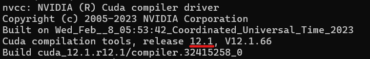

# speak-to-llm

Speak-to-llm is a straightforward tool that lets you chat with Large Language Models through the terminal featuring low latency Text-To-Speech powered by OpenAI and ElevenLabs. It supports all models available on Ollama, including the latest ones like Llama3 and Phi-3.
<hr> 

## Demo 🤖


## Requirements


### Ollama
The application uses Ollamas API for serving the local Large Language Models.

To install Ollama visit: https://ollama.com/download


### OpenAI
If you want to use Text to Speech you need to set your OpenAI API Key in as a environment variable.

```bash
export OPENAI_API_KEY = your_openai_api_key
```
If you are not familiar with the process you can visit this [guide](https://www.immersivelimit.com/tutorials/adding-your-openai-api-key-to-system-environment-variables)


### Optional (For Windows)
For installing the other requirements, I recommend using a package manager like [Chocolatey]([https://chocolatey.org/](https://chocolatey.org/install)) on Windows.

To install Chocolatey run powershell as an administrator and execute this command:
```bash
Set-ExecutionPolicy Bypass -Scope Process -Force; [System.Net.ServicePointManager]::SecurityProtocol = [System.Net.ServicePointManager]::SecurityProtocol -bor 3072; iex ((New-Object System.Net.WebClient).DownloadString('https://community.chocolatey.org/install.ps1'))
```

### ffmpeg
Download and install ffmpeg from https://ffmpeg.org/download.html and add it to the path.

with Chocolatey (run shell as admin):
```bash
choco install ffmpeg
````


### MPV ( Needed for elevenlabs TTS )
If you want to use elevenlabs you need to install mpv: https://mpv.io/installation/

with Chocolatey (run shell as admin):
```bash
choco install mpv
````

## Installation

Clone the repository and install the requirements.
```bash
git clone https://github.com/makefinks/speak-to-llm.git
cd speak-to-llm
pip install -r requirements.txt
```

If you have an NVIDIA GPU it is highly recommended to install the cuda version of torch. Without this whisper will run on your CPU and will be significantly slower.

<b>check your cuda version </b>
```bash
nvcc --version
```


<b>Install torch (change the last part to match your version) </b>
```
pip install torch torchvision torchaudio --extra-index-url https://download.pytorch.org/whl/cu121
```

## Usage

```bash
python talk_llm.py
```

<b> Arguments </b>

> --whisper <model_name>

Which whisper model to use for transcription ([All Models](https://github.com/openai/whisper)). Use large-v3 for the best quality if you have ~10GB VRAM.

> --llm <model_name>

Which LLM model to run with ollama. [Here](https://ollama.com/library) is a list of available models on ollama. Defaults to Llama3-8b.

> --tts <tts_provider>

Which Text-To-Speech provider to use. Options are "openai" or "elevenlabs".

> --lang <language>

Which language the conversation is going to be in. Options are "en" and "multi". Elevenlabs support a turbo model for english that is used when "en" is selected as the conversation language. The option "multi" is used for every other language but the latency is higher.

> --voice_id <elevenlabs_voice_id>

Which voice to use for ElevenLabs TTS.

> --silent

If the silent flag is set, no tts api requests are made and the output is purely in text.


